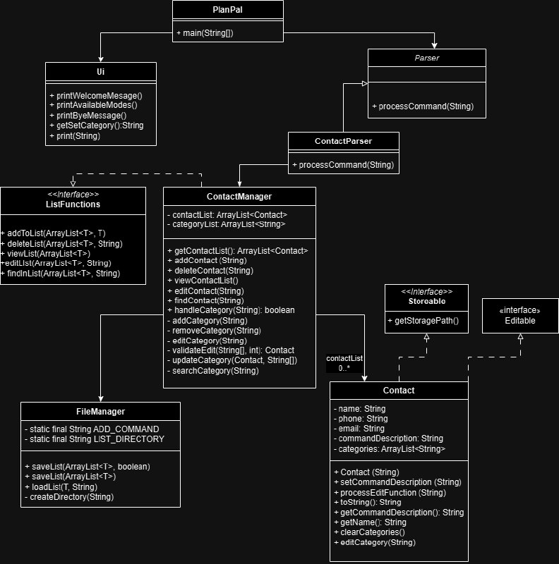
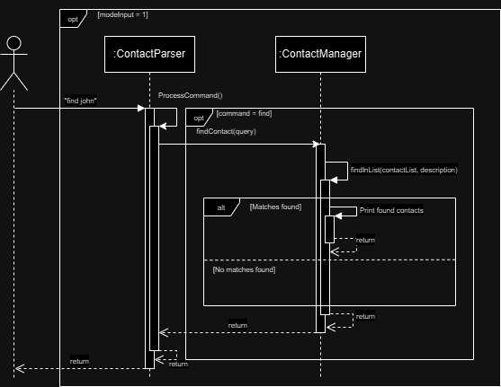

# Developer Guide

---
Welcome to the PlanPal Developer Guide! Thank you for taking an interest in the behind-the-scenes work of our product. We hope this document proves informative and useful for your work!

## Table of Contents
{to be inserted at a later date}

---

## Acknowledgements

{list here sources of all reused/adapted ideas, code, documentation, and third-party libraries -- include links to the original source as well}

## Setting up, getting started
1. Java 17 is required for PlanPal to function properly, please make sure your device has Java 17 installed. If not, you may download it [here](). If you need further assistance installing Java 17, you may refer to the [Installation Guide.]()
2. Once you have ascertained that your device has Java 17 installed, you may download the `.jar file` [here]().
insert SS of release page

Click on `PlanPal.jar` to automatically download the file. Place the file in a folder your choice.

## Design & Implementation

---
### Architecture

The **Architecture Diagram** given above explains the high-level design of the program. Given below is a quick overview of the main components.

### Main Components
- `PlanPal`: Main entry of the program, initialises and connects to the Ui
- `Ui`: In charge of printing messages
- `Parser`: Determines the command to execute
- `Modes`: Determines the group of functionalities that the user wants to use.
- `FileManager`: Read and write data from hard disk

### Program Flow
The sequence diagram below describes how the components interacts with one another when the user issues a command.
For simplicity, the 3 different modes will be classified as `:Mode`.

## Ui
<u>Overview</u>  
The `Ui` component handles operations that displays messages for the user to read as an instruction.  
Additionally, it is also used to capture user inputs in certain functions.

<u>Methods</u>  
The `Ui` component has the following key methods:

| Method                | Description                                                          |
|-----------------------|----------------------------------------------------------------------|
| printWelcomeMessage   | Prints the welcome message                                           |
| printAvailableModes   | Print all modes that are currently available in PlanPal              |
| printByeMessage       | Prints the good bye message                                          |
| printCreateStorage    | Prints the path to the storage that is created                       |
| getSetCategory        | Capture user input when using the category function in certain modes |
| printCat              | Prints the categories available in certain modes                     |
| printCategoryNotFound | Prints when category is not found                                    |
| print                 | Custom print function that accepts multiple strings                  |

<u>Design Considerations</u>  
This component was created as functionalities such as printing will be used in most of the classes in the PlanPal Application.  
Consolidating all the print methods that are repeated reduces repetition in code and makes it easier to update when necessary.

## Parser
<u>Overview</u>
This component handles the logic behind the application. The parser component consists of the parent `Parser` Class and 3 children that inherits the `Parser` Class. These 3 children are used when the respective modes are in play.

<u>Class Diagram for Parser Component:</u>  

<u>Design Considerations</u>  
The Parser class follows this structure as there are common commands between the different modes. Using inheritance prevents the repetition of code. Additionally, different parsers were created since different modes require different functionalities.

## Mode: Contact Manager
The class diagram below represents the contact book system

<u>Class Diagram</u>  

<u>Methods</u>  

| Method          | Description                           |
|-----------------|---------------------------------------|
| addContact      | Adds a contact to the contact list    |
| deleteContact   | Deletes a contact in the contact list |
| viewContactList | View the current contact list         |
| editContact     | Edit a contact in the list            |
| findContact     | Find a contact in the contact list    |

### Add Command
The sequence diagram below illustrates the process for resolving the "add" command.
  

<u>Components Breakdown:</u>
- For simplicity, the `Ui` component has been taken out
- `ContactParser` class is the `Parser` component
- `ContactManager` class is the `Mode` component

<u>Explanation:</u> 
- Before this command is executed, the user will have to choose their mode.
- When modeInput is 1, representing contact manager, the user is then asked for a command in this mode.
- When command "add /name: john" is sent, the processCommand function is executed.
- Since the command is "add", addContact function is executed using the description "/name: john". 
- This creates a new contact and is then added to the list of contacts
- Finally, contact file is saved in the savedContacts FileManager.

### List Command
The sequence diagram below illustrates the process for resolving the "list" command.  

<u>Components Breakdown:</u>
- For simplicity, the `Ui` component has been taken out
- `ContactParser` class is the `Parser` component
- `ContactManager` class is the `Mode` component
- There is no need for saving for list here.

<u>Explanation:</u>
- Before this command is executed, the user will have to choose their mode.
- When modeInput is 1, representing contact manager, the user is then asked for a command in this mode.
- When command "list" is sent, the processCommand function is executed.
- Since the command is "list", viewContactList command is executed, printing all the contacts in the list.

### Edit Command
The sequence diagram below illustrates the process for resolving the "edit" command.

<u>Components Breakdown:</u>
- For simplicity, the `Ui` component has been taken out
- `ContactParser` class is the `Parser` component
- `ContactManager` class is the `Mode` component

<u>Explanation:</u>
- Before this command is executed, the user will have to choose their mode.
- When modeInput is 1, representing contact manager, the user is then asked for a command in this mode.
- When command "edit" is sent, the processCommand function is executed.
- Since the command is "edit", editList command is executed using the description 1 /name: Bob.
- The editList function edits the category at the stated index
- Finally, contact file is saved in the savedContacts FileManager.

### Set Category Command
The sequence diagram below illustrates the process for resolving the "category" command.

### Find Command
The sequence diagram below illustrates the process for resolving the "find" command.

## Mode: Expense Manager
The class diagram below represents the Expense Manager system.

{insert class diagram}

### Add Command
The sequence diagram below illustrates the process for resolving the "add" command.

<u>Components Breakdown:</u>  
- For simplicity, the `Ui` component has been taken out
- `ExpenseParser` class is the `Parser` component
- `ExpenseManager` class is the `Mode` component

<u>Explanation:</u>  
The way the add command works for expense manager is similar to how it works for contact manager, with the only difference being the names used.

---
## Product scope
### Target user profile

{Describe the target user profile}
As an international student in NUS, I want to be able to...

### Value proposition

{Describe the value proposition: what problem does it solve?}

---

## User Stories

|Version| As a ... | I want to ...             | So that I can ...                                                              |
|--------|----------|---------------------------|--------------------------------------------------------------------------------|
|v1.0|NUS international student| see my list of contacts   | easily call home or look for emergency contacts when needed                    |
|v1.0|NUS international student| add a contact             | expand my list of useful contacts                                              |
|v1.0|NUS international student| delete a contact          | remove a contact if I no longer need it                                        |
|v1.0|NUS international student| edit a contact            | amend any mistakes when creating the contact or if the number has been changed |
|v1.0|NUS international student| save my contacts          | my contacts are still there when I exit and enter the app again                |                                                       |
|v2.0||  |                     |

---
## Non-Functional Requirements

{Give non-functional requirements}

## Glossary

* *glossary item* - Definition

## Instructions for manual testing

{Give instructions on how to do a manual product testing e.g., how to load sample data to be used for testing}