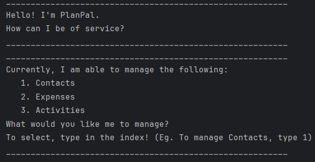
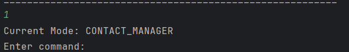

# User Guide

---
## Introduction

---

PlanPal is a desktop application designed for international students studying in NUS. It functions as an all-in-one organizational tool, enabling users to manage contacts, track expenses, and schedule activities. The user interacts with the application using a CLI and is written in Java 17.

## Purpose of User Guide

---
The purpose of this guide is to show you how to get started on using this PlanPal and to introduce you to the basics of using it. This includes getting to know the feature and syntax of the commands.

## Target Audience

---
NUS International students who are frugal and organized. It caters to the needs of these NUS international students, allowing them to keep track of important contacts, activities, as well as manage their spending while in a foreign country.

### Table of Contents
- [Quick start](#quick-start)
- [Warnings](#warnings)
  - [Validity of phone number](#validity-of-phone-number)
  - [Invalid Inputs](#invalid-inputs)
- [Features](#features)
  - [Modes](#modes)
  - [Contact Manager](#contact-manager)
    - [Add contact](#adding-a-contact)
    - [List contact](#viewing-the-contact-list)
    - [Edit contact](#editing-a-contact)
    - [Delete contact](#deleting-a-contact)
    - [Find contact](#finding-a-contact)
    - [Setting category](#setting-category)
      - [add category](#1-add-category)
      - [remove category](#2-remove-category)
      - [edit categories of contact](#3-edit-categories-of-contact)
      - [view categories](#4-view-categories)
      - [view the contact list](#5-view-the-contact-list)
      - [print category functions](#6-print-category-functions)
      - [exit category](#7-exit-category)
    - [Search contacts by category](#search-contacts-by-category)
  - [Expense Manager](#expense-manager)
    - [Set Budget](#setting-a-budget)
    - [Add expenses](#adding-an-expense)
    - [List expenses](#viewing-an-expense-list)
    - [Delete expenses](#deleting-an-expense)
    - [Find expenses](#finding-an-expense)
  - [Activity Manager](#activity-manager)
    - [Add activity](#adding-an-activity)
    - [List activity](#viewing-the-activities-list)
    - [Find activity](#finding-an-activity)
    - [Edit activity](#editing-an-activity)
    - [Delete activity](#deleting-an-activity)
  - [Auxiliary Commands](#auxiliary-commands)
    - [Backing Up Files](#backing-up-files)
    - [Restoring Back-up Files](#restoring-back-up-files)
    - ["Clearing" Screen](#clearing-screen)
    - [Exiting Modes](#exiting-modes)
    - [Leaving the Application](#leaving-the-application)
  - [Command Summary](#command-summary)

---
## Quick Start
1. Ensure that you have Java 17 or above installed.
2. Down the latest version of `PlanPal` from [here](https://github.com/AY2425S1-CS2113-W14-2/tp).
   Find the latest release and download `PlanPal.jar`. Place the file in a folder of your choice.
3. Open the command terminal and navigate to the folder where `PlanPal.jar` is downloaded.
4. Use the command `java -jar PlanPal.jar` to launch PlanPal
   On start up, you should see the following screen:  
   
5. When you are finished using PlanPal, use the `bye` command to terminate the application. This will ensure that your data is stored correctly and is available for future access.

---

## Warnings
Due to the nature of PlanPal as  CLI-based application, please take care to avoid malformed commands to avoid undesirable performance of PlanPal. Some examples are shown below

---
### Validity of phone number
Warning: PlanPal allows for phone numbers of any length to be entered

For example:


Example of how your phone number should look like. Since phone numbers outside of Singapore may not have the standard 8-digits, any length of phone number will be allowed, and it is up to the user to ensure the phone number is entered correctly.

---

### Invalid inputs
Warning: Inputs in PlanPal should not contain any `:` or `/`. Due to the fact they are used in determining the category, using `:` or `/` in your inputs may lead to unsatisfactory results when using PlanPal.

For example:


Example of invalid inputs. Since `/` and `:` is used in determining category, it detects that there is a second category within the name with a missing `/`. If there is a need to use a separator, please use any symbol other than `/` and `:`.

---
## Features
This section will focus on some of the key features of PlanPal and explain their usage. We will go over several features, including the Contact, Expenses and Activity Manager functionalities.

---
## Modes
Within PlanPal, there exists 3 modes, namely Contact Manager, Expense Manager, and Activity Manager.

---
1. To select the `mode` you want to use, enter a number ranging from 1 to 3. In this example, to use `Contacts`, enter 1 into the CLI.  
   
2. Functionalities for each `mode` will be expanded on below.
3. To exit any mode, use the `exit` command.

---

## Contact Manager
PlanPal will assist you in tracking the `Contacts` in your planner. The guide below will show you how to make use of the contact manager commands.

---
## Adding a Contact
The `add` command allows users to add a `Contact` with one or more of these categories: `name`, `phone`, `email`, and `category`.

### Usage:
```
add /name: <value 1> /phone: <value 2> /email: <value 3> 
```
Remarks : 

Category can <b>only be edited</b> using the `category` command. 

There are no other tags other than `name`, `phone`, `email` and `category` in Contact Manager.

Email format : must consist of four parts

character : `[a-zA-Z0-9_]` i.e. letters (uppercase and lowercase), digits (0-9), and underscores (_).

1) username : begins with at least one word character, followed by more word characters or `.` or `-` or nothing (directly to part 2). 
However, a `.` or `-` must follow by a word character. That is, the input string cannot begin with `.` or `-`; and cannot contain `..`, `--`, `.-` or `-.`. Example of valid string are `a.1-2-3`.

2) `@`.

3) email domain name : same rule as username (part 1).

4) matches a `.` followed by two or three word characters, e.g., `.com`, `.edu`, `.us`, `.uk`, `.co`.


### Example 1:
```
add /name: johnny /phone:12345678 /email:johnny@gmail.com
```
### Expected Output:
```
_________________________________________________________
Added successfully!
_________________________________________________________
Currently in list:
1. [Name = johnny, Phone = 12345678, Email = johnny@gmail.com, Categories = []]
_________________________________________________________
```

### Example 2:
```
add /name: johnny
```
### Expected Output:
```
_________________________________________________________
Added successfully!
_________________________________________________________
Currently in list:
1. [Name = johnny, Phone = null, Email = null, Categories = []]
_________________________________________________________
```
---
## Viewing the Contact List
The `list` command allows users to view all their current `Contacts`.

### Usage:
```
list
```

### Expected Output:
```
_________________________________________________________
Below is the list:
1. [Name = johnny, Phone = 12345678, Email = johnny@gmail.com, Categories = []]
_________________________________________________________
```
Format:
```
_________________________________________________________
Below is the list:
1. [Name = <name>, Phone = <phone>, Email = <email>, Categories = [<category1>, ...]]
_________________________________________________________
```

---
## Deleting a Contact
The `delete` command allows users to delete an existing `Contact` in the contact list.

### Usage
```
delete <index> 
```

### Example
The user wants to delete an existing `Contact` that has an index of '2' in the contact list.
```
delete 2
```

### Expected Output:
```
_________________________________________________________
Deleted successfully!
_________________________________________________________
Currently in list:
1. [Name = johnny, Phone = 12345678, Email = johnny@gmail.com, Categories = []]
_________________________________________________________
```
---
## Editing a Contact
The `edit` command allows users to edit a `Contact` from the list.

### Usage:
```
edit <index> /<category 1>: <value 1> /<category 2>: <value 2>... 
```
### Example 1:
```
edit 1 /name: Cassie
```
### Expected Output:
```
_________________________________________________________
Edited successfully!
_________________________________________________________
Currently in list:
1. [Name = Cassie, Phone = 12345678, Email = johnny@gmail.com, Categories = []]
_________________________________________________________
```
---
## Finding a Contact
The `find` command allows users to find `Contacts` from the list. User can search of multiple words at a time and the
input is not case-sensitive.

### Usage:
```
find <value>
```
### Example 1:
```
find alice david
```
### Expected Output:
```
_________________________________________________________
Here is what I found:
1. [Name = David, Phone = null, Email = null, Categories = []]
2. [Name = Alice, Phone = null, Email = null, Categories = []]
_________________________________________________________
```
---
## Setting category
The `category` command allows users to enter setting category mode to customize `category` in contacts.

Stored category data will be loaded automatically once enter contact mode. Once there is categories data corruption, 
error and subsequent adding, editing statements will be shown. 
After that, categories.txt will restore data from the backup file (with no error) automatically to prevent error in the next loading of the program.

### Usage:
```
category
```
### Expected Output:
```
_________________________________________________________
Current Mode: setting category mode
_________________________________________________________
```
### Remark : Inside setting category mode, any command other than those specified by the following 7 commands will result in
### Expected Output:
```
_________________________________________________________
invalid command
_________________________________________________________
```

The following 7 commands are the available commands in setting category mode.
---
### 1. Add Category (inside setting category mode)
The `add <category>` command allows users to add category 
that can be assigned to contact for efficient contacts searching by category.

Remark : This command only works in setting category mode. 
`add` outside setting category mode can perform a completely different function

Example 1 (successfully added):
```
add friend
```
Expected output:
```
_________________________________________________________
successfully added Category : 'friend'
_________________________________________________________
```
Example 2 ("/" is included):
```
add /friend
```
Expected output:
```
_________________________________________________________
/ is not allowed to be used in category name
_________________________________________________________
```
Example 3 (empty description):
```
add
```
Expected output:
```
_________________________________________________________
Description cannot be empty!
_________________________________________________________
```
Example 3 (category already exists):
```
add
```
Expected output:
```
_________________________________________________________
Category already exists
_________________________________________________________
```
---
### 2. Remove Category
The `remove <category>` command allows users to remove category. 
This command will automatically remove the original assignment of this category to all contacts

Remark : This command only works in setting category mode.

Example:
```
remove friend
```
Expected output if friend is not a category:
```
_________________________________________________________
friend is not a category
_________________________________________________________
```
Expected output if friend is a category:
```
_________________________________________________________
successfully deleted Category : 'friend'
_________________________________________________________
```
---
### 3. Edit Categories of Contact
The `edit <contact index> <category1/category2/...>` command allows users to assign
a category to contact and to delete the category assigned to contact.

Note: 
1. To add a category to a contact, the category needs to be added first
(refer to [here](#1-add-category-inside-setting-category-mode))
2. All details in category will be replaced with the new
category in this command, and <b>only one </b> category can be assigned to each
contact.

Format
```
edit <contact index> <category1/category2/...>
```
Example 1:
```
edit 1 friend
```
Expected output for successfully edit:
```
_________________________________________________________
successfully assigned categories to Contact id : 1
_________________________________________________________
```
Expected output if friend is not a category:
```
_________________________________________________________
friend is not a valid category
_________________________________________________________
```
<b> Note: If there is no category included in the command, the contact will be assigned with no category, i.e. remove all categories assigned to the contact. (See Example 2 below) </b>

Example 2:
```
edit 1
```
or
```
edit 1 /
```
Expected output if contact id is valid:
```
_________________________________________________________
successfully assigned categories to Contact id : 1
_________________________________________________________
```
Example 3 (contact id is invalid):
```
edit 0 friend
```
Expected output:
```
_________________________________________________________
Invalid contact id
_________________________________________________________
```

Example 4 (contact id is empty):
```
edit
```
Expected output:
```
_________________________________________________________
Description cannot be empty!
_________________________________________________________
```
---
### 4. View Categories
The `view` command allows users to view all categories that are existing 
and can be assigned to contacts.

Example:
```
view
```
Expected output:
```
_________________________________________________________
Below is the list:
1. friend
_________________________________________________________
```
---
### 5. View the Contact List
The `list` command allows users to view all their current `Contacts`.

Usage:
```
list
```

Expected Output:
```
_________________________________________________________
Below is the list:
1. [Name = johnny, Phone = 12345678, Email = johnny@gmail.com, Categories = []]
_________________________________________________________
```
Format:
```
_________________________________________________________
Below is the list:
1. [Name = <name>, Phone = <phone>, Email = <email>, Categories = [<category1>...]]
_________________________________________________________
```

---
### 6. Print Category Functions
This command will provide guide to functions in setting category mode.

Usage:
```
help
```

Expected Output:

---
### 7. Exit Category
This command allows users to exit the setting category mode.

### Example:
```
exit
```
Expected Output:
```
_________________________________________________________
exit category
_________________________________________________________
```
---
## Search Contacts by Category
The `search` command allows users to search `Contacts` belonging to user-defined `category`.

### Usage:
```
search <query>
```
### Example 1:
```
search friend
```
### Expected Output if category not defined:
```
Category not found.
_________________________________________________________
```
### Expected Output if no contacts in category:
```
Contacts in category: friend
There is no contact in friend
_________________________________________________________
```
### Expected Output if there exists contacts in category:
```
Contacts in category: friend
[Name = andy Phone = null Email = null]
_________________________________________________________
```
---


## Expense Manager
PlanPal will assist you in tracking your `Expenses` in your planner. The guide below will show you how to make use of the expense manager commands.

### Quick Guide
This section provides a quick tutorial on how to use expense manager.  
As a start, ALWAYS follow this sequence to prevent errors:
1. Set the budget using the `budget` command. PlanPal will still allow you to add expenses even when no budget is set / budget is negative. This is intentional since you can be in a deficit in real life.
2. Add expenses using the `add` command.
3. View the list when needed using the `list` command.
4. Exit the mode using the `exit` command.

**<ins>IMPORTANT NOTE</ins>**  
There are 2 additional tags you need to take note of.  
By default, the program assumes that you are working the current month and also NOT on the recurring list.  
Adding these tags to any of your commands in this mode does the following:
- `/recurring`: 
  - Tells the program to work on the recurring list of expenses. Does not support for budget.
  - It will only add items in the recurring expense list if **ALL** the following conditions are fulfilled:
    - A **NEW** list is being created
    - The month of the new list is **NOT** before the current month.
- `/month:`: 
  - Tells the program to work on that month's properties (budgets and expenses). 
  - The format should be `/month: <monthValue>`

---
## Setting a Budget
The `budget` command allows users to add a budget.  
By default, without the month being specified, it will assume that the month is the current month.  

**<ins>IMPORTANT NOTE</ins>**
- You CANNOT use `/recurring` tag for this function.
- You CANNOT use multiple `/month:` tags!

### Usage:
```
budget <value>
budget <value> <month>
budget <month> </> <value>
```
### Example:
```
budget 1000
budget 1000 /month: 2024-11
budget /month:2024-11 /1000
```
### Expected Output:
```
_________________________________________________________
For the month of 2024-11
Budget has been set to: $1000.0
_________________________________________________________
```
---
## Adding an expense
The `add` command allows users to add an expense to the expense list.  
By default, without any tags the following is assumed:
- Month is the current month
- It is NOT a recurring expense.

Currently, the fields that can be used are as follows:

| Field | Constraints                                                                                                                               |
|-------|-------------------------------------------------------------------------------------------------------------------------------------------|
| name  | Name is set to **null** by default                                                                                                        |
| cost  | Cost is set to **$0** by default                                                                                                          |
| type  | Type is set to **OTHER** by default <br/> Only these values are allowed: <br/>- FOOD<br/>- TRANSPORTATION<br/>- ENTERTAINMENT<br/>- OTHER |

**<ins>IMPORTANT NOTE</ins>**  
- Even if budget is not set, you can still add expenses.
- You can have negative budget since you are allowed to go into deficit.
- You should **NOT** use both `/recurring` and `/month:` tags together.
- if `/month:` tags are used together (which should not happen), the last month is prioritised

### Usage 1 (default addition without tags):
```
add /<field 1>: <value 1> /<field 2>: <value 2> /<field 3>: <value 3>... 
```
### Example:
```
add /name: Lunch /cost: 10 /type: food
```
### Expected Output:
```
_________________________________________________________
Added successfully!
_________________________________________________________
Currently in list:
1. [Name = Lunch, Cost = $10, Type = FOOD]
_________________________________________________________
```
### Usage 2 (with recurring tag):
```
add /recurring /<field 1>: <value 1> /<field 2>: <value 2> ... 
```
### Example:
```
add /recurring /name: Spotify /cost: 10.90 /type: entertainment
```
### Expected Output:
```
_________________________________________________________
Added successfully!
_________________________________________________________
Currently in list:
1. [Name = Spotify, Cost = $10.90, Type = ENTERTAINMENT]
_________________________________________________________
```
### Usage 3 (with month tag):
```
add /month: <monthValue> /<field 1>: <value 1> /<field 2>: <value 2> ... 
```
### Example:
```
add /month: 2024-11 /name: Spotify /cost: 10.90 /type: entertainment
```
### Expected Output:
```
_________________________________________________________
Added successfully!
_________________________________________________________
Currently in list:
1. [Name = Lunch, Cost = $10, Type = FOOD]
2. [Name = Spotify, Cost = $10.90, Type = ENTERTAINMENT]
_________________________________________________________
```
---
## Viewing an expense list
The `list` command allows users to view their expense list.  
By default, without any tags the following is assumed:
- Month is the current month
- It should NOT look for the recurring expense list.

Viewing list also shows the user's spending information:
- Spending proportion of that month for each expense type
- Total amount of money spent in a given month for each expense type

**<ins>IMPORTANT NOTE</ins>**
- You should not use both `/recurring` and `/month:` tags together.
- if used together, `/recurring` tag is prioritised

### Usage 1 (default addition without tags):
```
list
```
### Example:
```
list
```
### Expected Output:
```
_________________________________________________________
Below is the list:
1. [Name = lunch, Cost = $10, Type = FOOD]
2. [Name = gift, Cost = $20, Type = OTHER]
3. [Name = grab, Cost = $15, Type = TRANSPORTATION]
4. [Name = train, Cost = $8, Type = TRANSPORTATION]
5. [Name = cake, Cost = $15, Type = FOOD]
_________________________________________________________
For the month of 2024-11
    Total budget: $1000.0
    Total cost: $68.0
    Remaining budget: $932.0
_________________________________________________________
Expense Type Proportions:
    FOOD: 36.76%
    OTHER: 29.41%
    TRANSPORTATION: 33.82%
_________________________________________________________
Expense Type Cost Breakdown:
    FOOD: $25.00
    OTHER: $20.00
    TRANSPORTATION: $23.00
_________________________________________________________
```
### Usage 2 (with recurring tag):
```
list /recurring
```
### Example:
```
list /recurring
```
### Expected Output:
```
_________________________________________________________
Below is the list:
1. [Name = lunch, Cost = $10, Type = FOOD]
2. [Name = gift, Cost = $20, Type = OTHER]
3. [Name = grab, Cost = $15, Type = TRANSPORTATION]
4. [Name = train, Cost = $8, Type = TRANSPORTATION]
5. [Name = cake, Cost = $15, Type = FOOD]
_________________________________________________________
```
### Usage 3 (with month tag):
```
list /month: <monthValue>
```
### Example:
```
list /month: 2024-12
```
### Expected Output:
```
_________________________________________________________
Below is the list:
1. [Name = car rental, Cost = $80, Type = TRANSPORTATION]
2. [Name = dinner, Cost = $20, Type = FOOD]
3. [Name = movie, Cost = $10, Type = ENTERTAINMENT]
4. [Name = concert, Cost = $20, Type = ENTERTAINMENT]
_________________________________________________________
For the month of 2024-12
    Total budget: $900.0
    Total cost: $130.0
    Remaining budget: $770.0
_________________________________________________________
Expense Type Proportions:
    TRANSPORTATION: 61.54%
    FOOD: 15.38%
    ENTERTAINMENT: 23.08%
_________________________________________________________
Expense Type Cost Breakdown:
    TRANSPORTATION: $80.00
    FOOD: $20.00
    ENTERTAINMENT: $30.00
_________________________________________________________
```
---
## Editing an Expense
The `edit` command allows users to edit their expense list.  
By default, without any tags the following is assumed:
- Month is the current month
- It should NOT look for the recurring expense list.

**<ins>IMPORTANT NOTE</ins>**
- You should not use multiple `/recurring` and `/month:` tags together.
- if used together, `/recurring` tag is prioritised  
- if `/month:` tag is used together, the first month is prioritised

### Usage 1 (default addition without tags):
```
edit <index> </field:> <value> ...
```
### Example:
```
edit 1 /name: Dinner /cost: 20
```
### Expected Output:
```
_________________________________________________________
Edited successfully!
_________________________________________________________
Currently in list:
1. [Name = Dinner, Cost = $20, Type = FOOD]
2. [Name = Spotify, Cost = $10.90, Type = ENTERTAINMENT]
_________________________________________________________
```
### Usage 2 (with recurring tag):
```
edit <index> </recurring> </field:> <value> ...
```
### Example:
```
edit 1 /recurring /name: Netflix /cost: 18.70
```
### Expected Output:
```
_________________________________________________________
Edited successfully!
_________________________________________________________
Currently in list:
1. [Name = Netflix, Cost = $18.70, Type = ENTERTAINMENT]
_________________________________________________________
```
### Usage 3 (with month tag):
```
edit <index> </month:> <monthValue> </field:> <value> ...
```
### Example:
```
edit 1 /month: 2024-11 /name: Breakfast /cost: 5.40
```
### Expected Output:
```
_________________________________________________________
Edited successfully!
_________________________________________________________
Currently in list:
1. [Name = Breakfast, Cost = $5.40, Type = FOOD]
2. [Name = Spotify, Cost = $10.90, Type = ENTERTAINMENT]
_________________________________________________________
```
## Deleting an Expense
The `delete` command allows users to delete an expense from the expense list and displays the remaining expenses for that month.

By default, without any tags the following is assumed:
- Month is the current month (e.g. if today's date is 1 November 2024, the current month is 2024-11)
- A "/month:" field in a previous command does not affect the current delete command.
- It should NOT look for the recurring expense list.

**<ins>IMPORTANT NOTE</ins>**
- You should not use multiple `/recurring` and `/month:` tags together.

### Usage 1 (default deletion without tags):
```
delete <index> 
```
### Example:
```
delete 1 
```
### Expected Output:
```
_________________________________________________________
Deleted successfully!
_________________________________________________________
Currently in list:
```
### Usage 2 (with recurring tag):
```
edit <index> </recurring> 
```
### Example:
```
delete 1 /recurring 
```
### Expected Output:
```
_________________________________________________________
Deleted successfully!
_________________________________________________________
Currently in list:
```
### Usage 3 (with month tag):
```
delete <index> </month:> <monthValue>
```
### Example:
```
delete 1 /month:2024-05
```
### Expected Output:
```
_________________________________________________________
Deleted successfully!
_________________________________________________________
Currently in list:
```
## Finding an Expense
The `find` command allows users to find an expense from the expense list based on any of the fields.

By default, without any tags the following is assumed:
- Month is the current month (e.g. if today's date is 1 November 2024, the current month is 2024-11)
- A "/month:" field in a previous command does not affect the current find command.
- It should NOT look for the recurring expense list.

**<ins>IMPORTANT NOTE</ins>**
- You should not use multiple `/recurring` and `/month:` tags together.
- if used together, `/recurring` tag is prioritised
- if `/month:` tag is used together, the first month is prioritised
- 
### Usage 1 (default finding without tags):
```
find <query> 
```
### Example 1 (searching by name):
```
find dinner
```
### Expected Output:
```
_________________________________________________________
Here is what I found:
1. [Name = tues dinner, Cost = $7, Type = FOOD]
2. [Name = wed dinner, Cost = $6, Type = FOOD]
_________________________________________________________
```
### Example 2 (searching by cost):
```
find 7
```
### Expected Output:
```
_________________________________________________________
Here is what I found:
1. [Name = tues dinner, Cost = $7, Type = FOOD]
2. [Name = wed lunch, Cost = $7, Type = FOOD]
_________________________________________________________
```
### Example 3 (searching by type):
```
find transportation
```
### Expected Output:
```
_________________________________________________________
Here is what I found:
1. [Name = grab, Cost = $10, Type = TRANSPORTATION]
2. [Name = MRT, Cost = $2, Type = TRANSPORTATION]
_________________________________________________________
```
### Usage 2 (with recurring tag):
```
find <query> </recurring> 
```
### Example:
```
find spotify /recurring 
```
### Expected Output:
```
_________________________________________________________
Here is what I found:
1. [Name = Spotify, Cost = $10.90, Type = ENTERTAINMENT]
_________________________________________________________
```
### Usage 3 (with month tag):
```
find <query> </month:> <monthValue>
```
### Example:
```
find lunch /month:2024-05
```
### Expected Output:
```
_________________________________________________________
Here is what I found:
1. [Name = lunch, Cost = $5, Type = FOOD]
_________________________________________________________
```
---

## Activity Manager
PlanPal will assist you in tracking your `activities` in your planner. The guide below will show you how to make use of 
the activity manager commands.

---
## Adding an activity
The `add` command allows users to add an activity to the `activities` list.
If only the name of the `activity` is specified, the type of the activity will be set to `others` by default.

### Usage:
```
add /name: <name> /type: <type> 
```
### Example 1:
```
add /name: running /type: exercise
```

### Expected Output:
```
_________________________________________________________
Added successfully!
_________________________________________________________
Currently in list:
1. [activity = running, type = exercise]
_________________________________________________________
```
### Example 2:
```
add /name: sleep
```
### Expected Output:
```
_________________________________________________________
Added successfully!
_________________________________________________________
Currently in list:
1. [activity = running, type = exercise]
2. [activity = sleep, type = others]
_________________________________________________________
```

---
## Viewing the Activities list
The `list` command allows users to view all their current `activities`.

### Usage:
```
list
```
### Expected Output:
```
_________________________________________________________
Below is the list:
1. [activity: running, type: exercise]
2. [activity: swimming, type: exercise]
3. [activity: groceries, type: necessities]
_________________________________________________________
```
---
## Finding an activity
The `find` command allows users to find `activities` from the list. User can search of multiple words at a time and the input is not case-sensitive.

### Usage:
```
find <value>
```
### Example 1:
```
find exercise
```
### Expected Output:
```
_________________________________________________________
Here is what I found:
1. [activity = running, type = exercise]
2. [activity = swimming, type = exercise]
_________________________________________________________
```
---
## Editing an activity
The `edit` command allows users to edit an `activity` from the list.

### Usage:
```
edit <index> /<category 1>: <value 1> /<category 2>: <value 2> ...
```
### Example 1
```
edit 1 /name: diving
```
### Expected Output:
```
_________________________________________________________
Currently in list:
1. [activity = diving, type = exercise]
2. [activity = swimming, type = exercise]
3. [activity = groceries, type = necessities]
_________________________________________________________
```
---
## Deleting an Activity
The `delete` command allows users to delete an existing `activity` from the list, with
reference to its index in the list.

### Usage:
```
delete <index>
```
### Example 1:
```
delete 2
```
### Expected Output:
```
_________________________________________________________
Deleted successfully!
_________________________________________________________
Currently in list:
1. [activity = running, type = exercise]
2. [activity = groceries, type = necessities]
_________________________________________________________
```

---
## Auxiliary Commands
The commands below are not the main features of the 3 modes. However, they will make it more convenient for you when using the PlanPal application

**<ins>IMPORTANT NOTE</ins>**  
The commands below ONLY WORKS in the following screens of PlanPal:
- `Main Menu`
- `CONTACT_MANAGER`
- `EXPENSE_MANAGER`
- `ACTIVITY_MANAGER`


---
## Backing Up Files
The `/b/` command is able to store all your current files into a back-up folder in the event that you corrupted your data. This folder is also encrypted to ensure that your files are secured.

**<ins>IMPORTANT NOTE</ins>**
- This function is not automated! Users have to use the command to create the back-up manually.
- The constraint given for this project is to have data files that can be manipulated.
- In no way are we going against this since the data is being loaded from files that can be edited. 

### Usage:
```
/b/
```
---
## Restoring Back-up Files
The `/r/` command restores your data files to the state of the previously saved back-up files.

### Usage:
```
/r/
```
---
## "Clearing" Screen
The `clear` command can be used to simulate the clearing of the screen. It is done by printing multiple blank lines. This would help to reduce the clutter on your screen if you wish to do so.

### Usage:
```
clear
```
---
## Exiting Modes
The `exit` command can be used to switch between different modes.

### Usage:
```
exit
```
---
## Leaving the Application
The `bye` command can be used to shut down the program when you no longer need it.

### Usage:
```
bye
```
---
  
## Command Summary

### Auxiliary Commands 

| Description       | Command |
|-------------------|---------|
| Back Up Files     | `/b/`   |
| Restore Files     | `/r/`   |
| Clear Screen      | `clear` |
| Exit Mode         | `exit`  |
| Leave Application | `bye`   |


### Contact Manager  

#### Main Contact Manager Mode  


| Description                 | Command                                                        | Example                                                         |
|-----------------------------|----------------------------------------------------------------|-----------------------------------------------------------------|
| Adding a contact            | `add /name: <name> /type: <type>`                              | `add /name: PlanPal /phone: 12345678 /email: PlanPal@gmail.com` |
| Deleting a contact          | `delete <index>`                                               | `delete 1`                                                      |
| Viewing the contact list    | `list`                                                         | `list`                                                          | 
| Finding an activity         | `find <value>`                                                 | `find Plan`                                                     |
| Editing a contact           | `edit <index> /<field 1>: <value 1> /<field 2>: <value 2> ...` | `edit 1 /name: PlanPal_v1.0 /email: PlanPal_v1@gmail.com`       |
| Search contacts by category | `search <category>`                                            | `search friend`                                                 |
| Setting contact category    | `category`                                                     | `category`                                                      |


#### Inside Category Mode of Contact Manager  


| Description                   | Command                                              | Example                |
|-------------------------------|------------------------------------------------------|------------------------|
| Adding category               | `add <category>`                                     | `add friend`           |
| Removing category             | `remove <category>`                                  | `remove friend`        | 
| Edit contact category         | `edit <contact index> <category 1>/<category 2>/...` | `edit 1 friend/family` |
| Deleting contact category     | `edit <contact index>`                               | `edit 1`               |
| Viewing category list         | `view`                                               | `view`                 |
| Viewing the contact list      | `list`                                               | `list`                 |
| Printing category functions   | `help`                                               | `help`                 |
| Quiting setting category mode | `quit`                                               | `quit`                 |


### Expense Manager  


| Description                                      | Command                                                         | Example                                                              |
|--------------------------------------------------|-----------------------------------------------------------------|----------------------------------------------------------------------|
| Setting a Budget (default)                       | `budget <value>`                                                | `budget 1000`                                                        |
| Setting a Budget <br/>(with `/month:` tag)       | - `budget <value> <month>` <br/> - `budget <month> </> <value>` | - `budget 1000 /month: 2024-11`<br/> - `budget /month:2024-11 /1000` |
| Adding an Expense (default)                      | `add /<field 1>: <value 1> ...`                                 | `add /name: Lunch /cost: 10`                                         | 
| Adding an Expense <br/>(with `/recurring` tag)   | `add /recurring /<field 1>: <value 1> ...`                      | `add /recurring /name: Spotify /cost: 10`                            |
| Adding an Expense <br/>(with `/month:` tag)      | `add /month: <monthValue> /<field 1>: <value 1> ...`            | `add /month: 2024-11 /name: Spotify /cost: 10`                       |
| Viewing an Expense (default)                     | `list`                                                          | `list`                                                               |
| Viewing an Expense <br/>(with `/recurring` tag)  | `list /recurring`                                               | `list /recurring`                                                    |
| Viewing an Expense <br/>(with `/month:` tag)     | `list </month:> <monthValue>`                                   | `list /month: 2024-11`                                               |
| Editing an Expense (default)                     | `edit <index> </field:> <value> ...`                            | `edit 1 /name: Dinner /cost: 20`                                     |
| Editing an Expense <br/>(with `/recurring` tag)  | `edit <index> </recurring> </field:> <value> ...`               | `edit 1 /recurring /name: Netflix /cost: 18.70`                      |
| Editing an Expense <br/>(with `/month:` tag)     | `edit <index> </month:> <monthValue> </field:> <value> ...`     | `edit 1 /month: 2024-11 /name: Breakfast /cost: 5.40`                |
| Deleting an Expense (default)                    | `delete <index>`                                                | `delete 1`                                                           |
| Deleting an Expense <br/>(with `/recurring` tag) | `delete <index> </recurring>`                                   | `delete 1 /recurring`                                                |
| Deleting an Expense <br/>(with `/month:` tag)    | `delete <index> </month:> <monthValue>`                         | `delete 1 /month:2024-05`                                            |
| Finding an Expense (default)                     | `find query>`                                                   | `find dinner`                                                        |
| Finding an Expense <br/>(with `/recurring` tag)  | `find query> </recurring>`                                      | `find spotify /recurring`                                            |
| Finding an Expense <br/>(with `/month:` tag)     | `find <query> </month:> <monthValue>`                           | `find lunch /month:2024-05`                                          |


### Activity Manager  


| **Description**                       | **Command**                                                          | **Example**                          |
|---------------------------------------|----------------------------------------------------------------------|--------------------------------------|
| Adding an activity                    | `add /name: <name> /type: <type>`                                    | `add /name: running /type: exercise` |
| Adding an activity with just its name | `add /name: <name>`                                                  | `add /name: sleep`                   |
| Viewing the activity list             | `list`                                                               | `list`                               | 
| Finding an activity                   | `find <value>`                                                       | `find exercise`                      |
| Editing an activity                   | `edit <index> /<category 1>: <value 1> /<category 2>: <value 2> ...` | `edit 1 /name: diving`               |
| Deleting an activity                  | `delete <index>`                                                     | `delete 4`                           |

